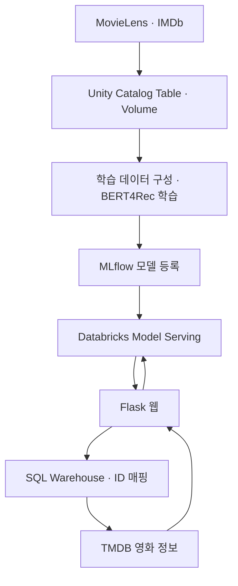

# MovieLens 기반 BERT4Rec 영화 추천 서비스

> 사용자의 영화 선호 이력과 장르 정보를 활용해 영화 10개를 추천하고, Databricks Model Serving과 Flask 웹으로 연결한 팀 프로젝트입니다.

## 1. 프로젝트 개요

많은 영화 중에서 사용자의 취향에 맞는 작품을 선택할 수 있도록, MovieLens의 평점 이력을 활용한 개인화 추천 서비스를 구현했습니다.

팀에서는 ALS, 군집화, 하이브리드, XGBoost, BERT 기반 추천 방식을 검토했고, 최종 웹 서비스에는 BERT4Rec 기반 모델을 연결했습니다.

| 항목 | 내용 |
|---|---|
| 개발 기간 | 2025.05.26 ~ 2025.06.11 |
| 팀 구성 | 6명 |
| 본인 담당 | 주제·데이터 제안, Gold 데이터 설계, BERT4Rec 모델 수정·평가, MLflow 모델 등록 및 서비스 연동 참여 |
| 개발 환경 | Azure Databricks, Unity Catalog, PyTorch, MLflow |
| 공개 코드 | 발표 후 정리한 코드이며, 본인 구현은 `1dt048/`에 포함 |

## 2. 주요 기능

| 기능 | 설명 |
|---|---|
| 선호 영화 입력 | 웹에서 검색·선택한 영화를 추천 모델의 입력으로 사용 |
| 개인화 영화 추천 | 영화 이력과 장르 정보를 활용해 영화 10개 추천 |
| 영화 정보 표시 | MovieLens와 TMDB의 ID를 연결해 한글 제목과 포스터 표시 |
| 모델 API 연동 | Flask 서버에서 Databricks Model Serving Endpoint 호출 |

## 3. 시스템 구성

학습 데이터와 모델 파일은 Unity Catalog의 Table·Volume으로 관리하고, 학습한 모델을 MLflow에 등록하여 웹 서비스에서 호출할 수 있도록 구성했습니다.

본인은 데이터 제안·적재, 모델용 데이터 설계, BERT4Rec 구현 수정과 모델 서비스화를 담당했습니다. Flask 웹 구현은 팀원이 담당했으며, 모델 API와 웹을 연결하는 과정에 공동 참여했습니다.

## 4. 본인 기여

### 4.1 데이터 선정과 모델용 Gold 데이터 설계

대용량 추천 데이터로 MovieLens를 제안했습니다. 다른 영화 데이터베이스의 ID와 연결할 수 있는 `links` 테이블이 있어 IMDb·TMDB 정보로 확장하기 적합하다고 판단했습니다.

- MovieLens와 IMDb 데이터를 확보하고 Unity Catalog에 적재
- 대용량 파일을 Volume에 먼저 업로드한 뒤 Table로 변환
- 팀 그룹에 필요한 접근 권한을 부여하여 컴퓨팅 환경의 데이터 접근 문제 해결
- 모델 학습·추론에 필요한 사용자, 영화, 평점, 시간 정보 중심으로 Gold 데이터 설계

BERT4Rec 입력을 구성할 때는 평점 **4점 이상**을 선호 이력으로 사용했습니다. 평점 기록의 시간순으로 시퀀스를 구성하고, 학습용 사용자는 선호 이력이 **4개 이상**, 테스트용 사용자는 **13개 이상**인 경우를 대상으로 했습니다.

관련 코드: [bert4rec-with-genres-embed.ipynb](1dt048/bert4rec-with-genres-embed.ipynb)

### 4.2 장르 정보를 활용한 BERT4Rec 구현 수정

SASRec, BERT4Rec, 장르 임베딩이 포함된 BERT4Rec 구현을 순서대로 검토한 뒤, 장르 정보를 사용하는 기존 구현을 프로젝트에 맞게 수정했습니다.

모델은 영화 ID·위치·장르 임베딩을 합산하여 Transformer에 입력합니다. 장르 정보는 18차원 멀티핫 벡터를 신경망으로 변환해 사용합니다.

| 수정 항목 | 내용 |
|---|---|
| 데이터 입력 | CSV 로딩을 Unity Catalog 테이블 조회 방식으로 변경 |
| 선호 이력 구성 | 평점 4점 이상 필터와 사용자별 최소 이력 조건 적용 |
| 추천·평가 구성 | Top-10 결과를 평가하도록 수정하고 Precision@10·Recall@10 추가 |
| 출력 크기 | `[PAD]`, `[MASK]`를 포함하도록 출력 크기를 `num_items + 2`로 수정 |
| 무작위 아이템 대체 | 대체 영화의 실제 장르 정보를 사용하도록 수정 |
| 대체 후보 구성 | 입력 시퀀스에 이미 있는 영화를 무작위 대체 후보에서 제외 |

무작위 아이템 대체는 **MLM 학습 데이터를 만드는 과정**입니다. 대체 영화와 장르 정보를 일치시켜 학습 입력의 일관성을 확보했습니다.

원본 구현: [constantfear/bert4rec](https://github.com/constantfear/bert4rec)

### 4.3 테스트 데이터 구성과 평가 로직 구현

별도의 테스트 테이블을 읽는 데이터 로더를 구성했습니다. 테스트 사용자별로 시간순 마지막 10개 영화를 정답으로 분리하고, 그 이전 이력을 모델 입력으로 사용했습니다.

| 구분 | 구성 |
|---|---|
| 학습 입력 | `train_data`와 `validation_data`를 합쳐 선호 이력 구성 |
| 테스트 입력 | `test_data`에서 사용자별 마지막 10개를 제외한 이력 |
| 테스트 정답 | 사용자별 시간순 마지막 10개 영화 |
| 평가 후보 | 정답 영화 10개 + 무작위 미관측 영화 100개 |
| 평가 지표 | NDCG@10, Hit@10, Precision@10, Recall@10 |

이 평가는 **샘플링한 후보군 내 순위 평가**입니다. 전체 영화 목록에서 상위 10개를 추천하는 평가와는 조건이 다릅니다.

### 4.4 MLflow 모델 등록과 웹 서비스 연동

프로젝트 기간에는 먼저 학습을 완료하고 Volume에 저장한 모델을 MLflow에 등록하여 서비스에 연결했습니다.

- 학습 모델을 `mlflow.pyfunc` 형식으로 래핑
- 영화 ID 인코더·디코더 등 추론에 필요한 파일을 함께 패키징
- 입력 예시와 모델 시그니처, 실행 환경 의존성 정의
- `bert4rec_v4` 이름으로 모델 등록
- Databricks Model Serving Endpoint를 통해 Flask 웹과 연동

서빙 환경을 구성하는 과정에서는 Python 및 패키지 버전 불일치로 배포가 실패했습니다. 로그를 확인하며 실행 환경의 의존성을 조정하여 모델을 서비스에 연결했습니다.

관련 코드:

- [모델 등록 노트북](1dt048/rertv4rec_model_mlflow_upload.ipynb)
- [모델 로드·추론 확인 노트북](1dt048/mlflow_model_load_test.ipynb)

## 5. 개인 추가 실험 — MLflow 실험 추적

모델 등록·서비스 연동 이후, Databricks의 MLflow 실험 추적 기능을 활용하기 위한 개인 추가 실험을 진행했습니다.

학습·평가 로직은 유지하고 은닉 차원, 레이어 수, Attention Head 수, 학습률, 드롭아웃, 마스킹 비율 등의 하이퍼파라미터를 변경했습니다. 총 **10개 설정**의 학습 손실과 추천 지표를 실행별로 기록하고 비교했습니다.

| 항목 | 내용 |
|---|---|
| 기록 대상 | 하이퍼파라미터, 학습 손실, 추천 평가 지표, 모델 |
| 확인된 최고 NDCG@10 | **0.9022** |
| 해당 실행의 Precision@10 / Recall@10 | **0.8769 / 0.8769** |
| 평가 조건 | 정답 영화 10개와 무작위 미관측 영화 100개로 구성한 후보군 |

수치는 보관 중인 MLflow 실행 화면 기준입니다. 동일한 평가 데이터를 반복 활용해 설정을 비교한 결과이며, 설정 선택 이후 별도의 독립 평가를 수행한 결과는 아닙니다.

여러 하이퍼파라미터를 함께 변경했으므로 개별 변경의 효과를 분리해 해석하지 않았습니다. 이 추가 작업에서는 성능 수치뿐 아니라 **실험 설정과 결과를 실행 단위로 남기고 비교하는 과정**을 경험했습니다.

## 6. 기술 스택

| 영역 | 기술 |
|---|---|
| 개발 언어 | Python |
| 데이터 관리 | Azure Databricks, Unity Catalog Table·Volume |
| 데이터 처리 | PySpark, Pandas, NumPy |
| 모델 학습 | PyTorch, BERT4Rec |
| 모델 관리·서빙 | MLflow, Databricks Model Serving |
| 웹 서비스 | Flask, Databricks SQL Connector, REST API |
| 데이터·외부 연동 | MovieLens 32M, IMDb, TMDB API |

데이터 조회·필터링에는 Spark를 사용하고, 이후 Pandas로 변환하여 PyTorch 학습 데이터를 구성했습니다.

## 7. 코드 및 시연 자료

| 경로 | 내용 |
|---|---|
| [1dt048/bert4rec-with-genres-embed.ipynb](1dt048/bert4rec-with-genres-embed.ipynb) | 본인 담당: 데이터 로더, 모델, 학습·평가 |
| [1dt048/rertv4rec_model_mlflow_upload.ipynb](1dt048/rertv4rec_model_mlflow_upload.ipynb) | 본인 담당: 추론 모델 패키징 및 MLflow 등록 |
| [1dt048/mlflow_model_load_test.ipynb](1dt048/mlflow_model_load_test.ipynb) | 본인 담당: 등록 모델 로드 및 추론 확인 |
| [데이터 처리.ipynb](데이터%20처리.ipynb) | 팀 공통 데이터 처리 코드 |
| [1dt026/FLASK/app.py](1dt026/FLASK/app.py) | 팀원 담당: 웹 서버 및 모델·영화 정보 API 연동 |

[서비스 시연 영상](https://youtu.be/nEBNvA5RPlM)

공개 코드는 프로젝트 구현 기록입니다. 전체 실행에는 당시 Databricks 데이터 테이블·Volume, 학습 가중치, 등록 모델 및 외부 서비스 설정이 필요합니다.

## 8. 한계 및 개선 방향

- **평가 범위 확장:** 샘플링 후보군 평가 외에 전체 아이템 대상 평가를 추가하고, 하이퍼파라미터 선택용 검증 데이터와 최종 테스트 데이터를 분리할 필요가 있습니다.
- **학습·추론 방식 정합성:** 현재 평가 코드는 입력 마지막 위치의 출력을 사용합니다. 추론 시 `[MASK]` 위치를 사용하는 방식과 비교하여 MLM 학습 목적과의 정합성을 검토할 필요가 있습니다.
- **영화 특성 확장:** 장르 외에 감독·배우 등의 정보를 추가하고, 평점을 이진 필터 대신 선호 강도로 반영하는 방식을 검토할 수 있습니다.
- **신규 영화 대응:** 학습되지 않은 영화에 대응하기 위한 콘텐츠 기반 추천이나 별도 후보 생성 방식이 필요합니다.
- **재학습 자동화:** 데이터 갱신부터 학습·평가·배포까지 이어지는 자동화된 재학습 과정은 구현하지 않았습니다.
